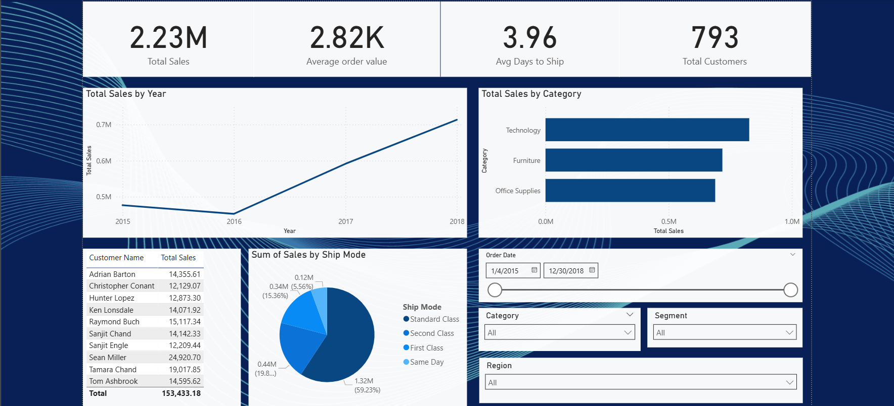

# 📊 Superstore Sales Analysis

## 💬 Overview
This end-to-end analytics project explores Superstore sales performance using **Excel**, **MySQL**, and **Power BI** to uncover trends, identify key customers, and forecast revenue.  
The analysis transforms raw data into actionable insights by integrating SQL data processing with interactive Power BI dashboards.

## 📁 Contents
- **data/**: Raw and cleaned datasets used for analysis.  
- **sql/**: SQL scripts used for data import, transformation, and aggregation.  
- **dashboard/**: Power BI interactive dashboards (.pbix).  
- **images/**: Dashboard screenshots for preview.  

## 🧰 Tools Used
- **Microsoft Excel** — Initial data cleaning and structure review.  
- **MySQL** — Database creation, SQL queries, sorting, grouping, and data aggregation.  
- **Power BI** — Data modeling, DAX measures, visualization, and KPI dashboards.  

## ⚙️ Workflow
1. **Excel**: Loaded and inspected the raw Superstore dataset (~9,800 rows).  
2. **MySQL**: Imported CSV data, executed SQL queries for data transformation — including customer segmentation, product category analysis, and regional sales aggregation.  
3. **Power BI**:  
   - Cleaned and shaped data in Power Query.  
   - Built DAX measures for key metrics (Total Sales, Average Discount, YoY Growth, Profit Margin).  
   - Designed a fully interactive dashboard to visualize performance across categories, customers, and regions.  

## 📈 Dashboard KPIs
- 💵 **Total Sales:** $2.26M  
- 🌎 **Top Region:** West (31% of total sales)  
- 💻 **Top Category:** Technology  
- 🧍 **Top Customer:** Sean Miller (~$25K in sales)  
- 📊 **YoY Growth:** ~50% (2015–2018)  
- 🗓️ **Sales Peak:** November–December (Holiday Season)  

## 🚀 Key Insights
- 📅 **Sustained Year-over-Year Growth:** Sales steadily increased from 2015–2018, showing strong market demand and customer retention.  
- 💼 **Category Performance:** Technology and Office Supplies dominated sales — highlighting ongoing investment in digital tools and workplace efficiency.  
- 🧭 **Regional Dominance:** The Western region led with the highest revenue, reflecting stronger logistics and customer accessibility.  
- 🎁 **Seasonal Trend:** Significant spikes in November–December suggest strong responses to holiday promotions — an ideal period for targeted marketing.  
- 👥 **Customer Value Distribution:** A small segment of high-value customers contributed disproportionately to total sales — emphasizing the importance of personalized retention strategies.  

## 🖼️ Preview

## 🎯 Takeaway
This project showcases how structured **data analytics workflows** can transform raw data into meaningful business intelligence.  
By combining **SQL’s analytical power** with **Power BI’s visualization**, it delivers clear, data-driven insights that support strategic decision-making.

## 📫 Contact
Created by **Bhaumik Sharma**  
[GitHub Profile](https://github.com/BhaumikSharma05)
